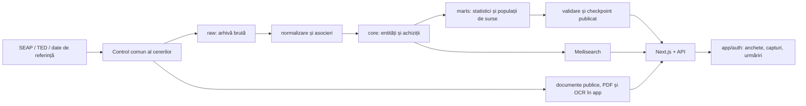

# Arhitectură și harta codului

## Stack și pachete

Versiunile efective se iau din `pnpm-lock.yaml`; valorile de mai jos sunt cele declarate la predare.

| Componentă | Rol |
|---|---|
| Node 22+, pnpm 9.4.0, Turborepo | Workspace TypeScript; pachete compilate în `dist` |
| `apps/web` | Next 16.2.10, React 19.2, App Router, interfață și API-uri |
| `apps/ingestion` | Colectare, normalizare, asocieri, agregări, validare, publicare, indexare |
| `packages/db` | Drizzle 0.45, postgres.js 3.4, scheme, migrații, politici comune de colectare/publicare |
| `packages/domain` | Tipuri și funcții ale domeniului |
| `packages/scraper-clients` | Clienți pentru sursele externe |
| PostgreSQL 16 | Sursa de adevăr pentru date, dovezi, autentificare și cozi |
| Meilisearch 1.16 | Index derivat pentru căutarea entităților |
| Better Auth 1.6 | Conturi create de admin, parolă și OTP obligatoriu pe email |
| PDF.js 6.3.289 | Randarea locală și sincronizată a paginii PDF |
| Playwright/Chromium, OpenSSL, Poppler, Tesseract | Preluarea documentelor și extragerea textului în worker |

Arhivarea este înaintea parsării. Transformările trebuie să se poată relua din răspunsul existent, fără o nouă colectare. O parte a istoricului normalizat a fost importată fără întreaga arhivă brută pe producție: nu presupune că orice rebuild total este posibil din producție fără inspecție.

## Scheme PostgreSQL

| Schemă | Conținut și tratament |
|---|---|
| `raw` | `raw_documents`, `ca_notice_ted`; răspunsuri brute, identitate și hash pentru deduplicare |
| `core` | Entități, ID-uri SICAP, achiziții directe, anunțuri, contracte, câștigători, TED, asocieri, flag-uri, praguri, watermark-uri, carantină |
| `marts` | Tabele statistice, profiluri, tranzacții pentru surse, Radiografie, TED, mostre de semnale |
| `reference` | CPV/sinonime, UAT, asocieri autoritate–UAT, bilanțuri MF, ONRC/reprezentanți |
| `auth` | Utilizatori, parole hash, sesiuni, verificări, material2FA — nu se distribuie |
| `app` | Dovezi/anchete/urmăriri private, rețete, control/cozi/audit; și documentele publice partajate |
| `drizzle` | Istoric migrații — trebuie păstrat cu snapshot-ul |
| `graphile_worker` | Infrastructură istorică de joburi; nu este coada de producție curentă pentru recuperare |
| `repair_20260927` | Copie tehnică temporară a arhivei TED; exclusă din transferul către coleg |

Nu clasifica întreaga schemă `app` drept publică și nici întreaga schemă drept dispensabilă: PDF-urile sunt în `app.document_blobs`, iar proveniența analitică în `app.monitoring_refreshes`.

Extensii necesare: `pg_trgm`, `unaccent`, `fuzzystrmatch`, plus `plpgsql`. Dump-ul logic păstrează definițiile lor. Nu se copiază volumul fizic PostgreSQL între arhitecturi Apple Silicon/Intel/Linux.

## Identități și precizie — capcane reale

- `core.contracts.id` este ID intern; `ca_notice_contract_id` este identitatea externă folosită de pagina contractului. `marts.contract_transactions.contract_id` este **intern**.
- Bridge: `apps/web/app/contracte/i/[cid]/route.ts`; răspunsul are Location relativ. În drawer se păstrează tabul original.
- ID-urile `core.flags` și `marts.lot_patterns` se pot regenera. O captură durabilă leagă un descriptor și hash/versiune, nu doar un număr reutilizabil.
- Totalurile contractelor atribuite unui consorțiu pot reprezenta alocări estimate egal între membri când nu există valori individuale. Nu dubla suma însumând contractul integral pentru fiecare câștigător.
- Cantitățile, monedele, intervalele și plafoanele TED nu devin automat valori RON scalare. Proveniența câmpului și tipul sumei sunt păstrate.
- Modurile `profiles` și `transactions` au populații diferite. Pentru linkuri vechi se conservă semantica istorică.
- Un nume afișat lângă un ID nu schimbă identitatea întrebării. Rezolvarea tardivă a etichetei nu trebuie să marcheze un formular ca modificat.
- Comparațiile și dovezile leagă și checkpoint-ul datelor; compararea a două momente diferite fără indicare explicită este greșită.

## Harta principalelor module

Toate căile sunt relative la rădăcină.

| Subiect | Unde începi |
|---|---|
| Layout, fonturi, teme | `apps/web/app/layout.tsx`, `globals.css`, `approved.css`, `lib/site.ts` |
| Întrebări | `apps/web/lib/ask/spec.ts`, `compile.ts`, `population.ts`, `population-sql.ts`, `resolved-spec.ts`, `source-spec.ts`, `evidence.ts`, `permalink.ts` |
| Drawer și surse | `apps/web/app/intreaba/EvidenceDrawer.tsx`; `lib/source-evidence.ts`, `signal-evidence.ts`, `radiografie-evidence.ts` |
| Dovezi imuabile | `lib/evidence-capture-input.ts`, `evidence-captures.ts`, `evidence-captures-shared.ts`, `evidence-bundle.ts`, `evidence-zip.ts` |
| Anchete și permisiuni | `lib/investigation-access.ts`, `investigation-workspace.ts`, `workspace-api.ts`; `app/anchete/` |
| Rețete | `lib/recipes.ts`, `app/api/recipes/`, `app/intreaba/RecipeShelf.tsx` |
| Urmăriri | `lib/monitoring*.ts`, `app/urmariri/`, `app/api/urmariri/`, `scripts/monitoring-worker.ts` |
| Digest email | `lib/monitoring-digests.ts`, `scripts/monitoring-digests.ts` |
| Legături | `lib/connections*.ts`, `connection-evidence*.ts`, `app/entitati/[id]/legaturi/` |
| Comparații | `lib/peers*.ts`, `peer-population.ts`, `app/api/peers/`, `app/entitati/[id]/comparatii/` |
| Populație RPL2021 | `apps/web/lib/reference/population-rpl2021.json`; `packages/db/scripts/parse-population-rpl2021.py` |
| Fișiere | `apps/web/lib/documents/{store,seap,worker,process,rate-limit,shared}.ts`; `apps/web/scripts/documents/worker.ts` |
| Admin | `app/admin/layout.tsx`, `AdminNavigation.tsx`, `CollectionDashboard.tsx`, `RecoveryOverview.tsx`, `DocumentQueue.tsx`; `lib/admin/` |
| Estimare recuperare | `lib/admin/recovery-status.ts`, `recovery-forecast.ts` și testele lor |
| Autentificare | `apps/web/lib/auth.ts`, `mail.ts`, `scripts/seed-admin.ts`; `packages/db/src/schema/auth.ts` |
| Colectare durabilă | `apps/ingestion/src/scripts/collection.ts`, `src/collection/` |
| Poarta comună SEAP | `packages/db/src/collection.ts`, `collection-policy.ts`, `collection-quiet-window.ts`, `collection-retry.ts`, `collection-diagnostics.ts` |
| Publicare și validare | `apps/ingestion/src/monitoring/{refresh,pipeline,validate,coverage,cli}.ts`; `packages/db/src/processing.ts` |
| Parsare/asociere TED | `apps/ingestion/src/normalize/{ted,ted-fforms,ted-load,ted-replay,reconcile,ted-mart}.ts` |
| Index de căutare | `apps/ingestion/src/search/index-entities.ts`, `src/scripts/index-search.ts`; `apps/web/lib/search.ts` |
| Deploy și scheduler | `infra/prod/deploy.sh`, `process-nightly.sh`, Dockerfiles, compose; `.github/workflows/ci.yml` |
| Migrații | `packages/db/migrations/`, `src/schema/`, `scripts/deploy-migrate.mjs`, `migration-history.mjs` |

Pentru o cale redenumită folosește `rg --files`, nu presupune că această hartă înlocuiește codul.

## Capturi și exporturi

Captura se reconstruiește pe server din identitatea selecției; un browser nu poate inventa totalul, lista de membri sau sursele. Copiere SQL-to-SQL într-un snapshot repeatable-read, valori zecimale exacte, versiuni imuabile și acces verificat din nou la publicare. Selecțiile nominale foarte mari au limite explicite; nu se trunchiază în tăcere. Exportul live CSV și captura integrală au mecanisme/limite distincte.

ZIP64 permite pachete mari cu CSV/NDJSON, metodologie, istoric și manifest SHA-256. Nu afirmăm că un ZIP conține toate binarele externe dacă oferă doar referințele lor.

## Documente — mecanismul real

Pentru familiile suportate se rezolvă anunțul prin identitate și autoritate, apoi se citește lista. Nu orice familie de anunțuri are încă implementată preluarea. Pilotul verificat folosește SCN/type 17, de exemplu `https://www.e-licitatie.ro/pub/notices/simplified-notice/v2/view/100231768`. URL-ul de fișier nu este identitate durabilă.

Worker-ul folosește o sesiune Chromium nouă, metadata proaspete, POST de verificare urmat de GET în aceeași sesiune, cu Referer-ul familiei corecte. Un GET izolat cu hash vechi poate eșua deși browserul utilizatorului descarcă fișierul. Nu copia Cookie/Authorization/chei din DevTools în cod sau documente. Doar cererile allowlistate ies din browser; resursele și redirecturile nepermise sunt blocate.

Limite inițiale:50 MiB,150 pagini; PDF sau CMS/P 7 S DER suportat. Poppler pentru text nativ, Tesseract `ron+eng` pentru paginile fără text suficient. Originalele și PDF-urile derivate sunt separate și adresate prin SHA-256. Textul și paginile devin disponibile după commit-ul procesării complete. Worker-ul este exclusiv prin advisory lock plus constrângere „un singur job running”.

## Migrații și restaurare

Schema curentă include obiecte `auth`, `app`, `reference` bootstrapate istoric și apoi reflectate în snapshot-uri Drizzle. Migrarea de la o bază complet goală **nu este procedura verificată de onboarding**. Folosește dump-ul care include structura și istoricul exact; nu sintetiza manual baseline-uri.

`0005` are un checksum istoric compatibil tratat explicit după verificarea structurii `national_stats`. Nu rescrie istoria migrațiilor ca să elimini avertismentul. Migrațiile noi trebuie să păstreze compatibilitatea cu worker-ul încă pornit pe vechea versiune. Proiecțiile `SELECT *` în prepared statements au produs deja un incident la adăugarea coloanelor; folosește coloane explicite în controlul de lungă durată.

## Registrul semnalelor și Radiografie

Cele 13 tipuri de întrebări nu sunt același lucru cu cele 13 familii de semnale. Registrul de calcul este `apps/ingestion/src/flags/methodology.ts` (versiune declarată `rf-2026.5` la predare); prezentarea web este în `apps/web/lib/flags.ts`. Schimbarea unei reguli necesită metodologie/versionare, surse, teste și validarea consecințelor asupra checkpoint-urilor, nu doar schimbarea unui label.

| Cod | Denumire în interfață |
|---|---|
| `da_split` | Fracționare sub prag |
| `da_concentration` | Concentrare pe un furnizor |
| `da_dependence` | Dependență de o autoritate |
| `da_rapid` | Finalizare fulger |
| `da_round` | Valoare aproape de prag |
| `da_year_end` | Vârf de final de an |
| `award_no_competition` | Negociere fără publicare prealabilă |
| `award_single_bid` | O singură ofertă raportată în TED |
| `award_concentration` | Concentrare pe un câștigător |
| `award_dependence` | Furnizor captiv unei autorități |
| `fin_tiny_staff` | Firmă minusculă, bani publici mari |
| `fin_public_reliance` | Dependență de bani publici |
| `net_shared_admin` | Firme surori la aceeași autoritate |

Definițiile, ferestrele temporale, clasificarea după tip/data de referință și excluderile sunt în cod/teste; nu aplica automat pragul actual întregului istoric. Valoarea estimată, valoarea de închidere, plafoanele și plățile au semantici diferite. „O singură ofertă” necesită un număr raportat și asociere confirmată; egalitatea prețului minim/maxim sau numărul membrilor unui consorțiu nu demonstrează acest lucru.

Radiografie este un pipeline distinct (`apps/ingestion/src/flags/radiografie.ts`, cititor `apps/web/lib/radiografie.ts`): concentrare, dependență, fracționare și tipare între loturi/parteneri (`rotatie`, `impartire`, `maturare`, `consortiu`). Fiecare observație trebuie să ducă la grupul exact de înregistrări. Radiografie se actualizează zilnic; faptul că flag-urile/CRI sunt săptămânale nu înseamnă că toate observațiile analitice sunt săptămânale.
