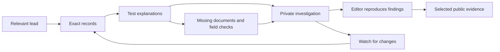

# From procurement exploration to a defensible investigation

Research date: 14 September 2026. Application revision: `7b9ae310fb05663c833f33aa67f33d81a426a06d`.

The most valuable next step is to connect discovery, verification and case-building. cinecâștigă? already helps a reporter find a pattern. It should help them answer the next questions: **Is this unusual? What exactly supports it? What might explain it? What evidence is still missing? Can my editor reproduce it?**

I would make **Anchete the working investigation desk**, with Semnale, Radiografie, Construiește and Domenii feeding it. Keep the approachable public interface and disclose the deeper tools progressively.

## Method and limits

This was a reporter-role product assessment, not an investigation into the named institutions or companies and not a claim of affiliation with a newsroom. I inspected the running local application at `http://localhost:3100`, its code and data architecture, and relevant primary guidance. Three independent code reviews covered queries, data/signals, and investigation/evidence workflows.

Browser inspection covered home, search, Construiește, Semnale with and without a county selection, two entity profiles, Radiografie, a contract page, TED, the source drawer, and the Anchete login boundary. A small source CSV was checked against its API response. No runtime exceptions occurred in these walkthroughs. Authenticated creation, collaboration and dossier export were assessed in code, not exercised with a user account. SEAP originals were not fetched from this device; source links and imported provenance were inspected. Bounded read-only checks of imported TED data supported the parser finding below. No product code or database content was changed.

Browser evidence is preserved in [observations.json](investigative-workflows-evidence/observations.json) and the linked screenshots. Figures describe the inspected snapshot, not a completeness claim about Romanian procurement.

## What a reporter can already do

- Start with an institution, company, locality or purchasing category; follow contracts and counterparties.
- Use 13 deterministic question types, including rankings, evolution, relationships and a recorded-transaction fact check. The AI input is deliberately disabled.
- Inspect 13 risk indicators. These are a separate set from the 13 question types.
- Open an authority's Radiografie for dependency, repeated lot winners, consortium patterns and possible purchase splitting.
- Filter source records, inspect exact monetary values, follow SEAP links and export CSV.
- Save findings and notes into a private investigation. Snapshots and some on-open change detection already exist.
- Examine company financial context and legal representatives, and use TED as a separately labeled publication source.

These assets should be extended. Rebuilding them as new dashboards would add navigation without necessarily helping reporting.

## Observed reporting obstacles

| Attempt | What happened | Consequence and evidence |
|---|---|---|
| Find splitting signals in Cluj | The sidebar changed to 457 authorities in Cluj. The main signal section remained byte-for-byte identical to the national section. | A reporter cannot rely on the visible county control to scope leads. The main query has no county argument and takes 50 rows. [Code](../../apps/web/app/semnale/page.tsx#L308), [filtered screenshot](investigative-workflows-evidence/signals-cluj.png). |
| Establish one institution's total | `/entitati/2144364` displayed **80.8 million lei** as “Valoare totală”; its largest listed supplier alone had **332.1 million lei**; search and Radiografie displayed approximately **1.5 billion lei**. | The profile uses a historical DA flag summary while other sections use different populations. This is a population/presentation inconsistency, not evidence of misconduct. [Profile](investigative-workflows-evidence/authority.png), [code](../../apps/web/app/entitati/[id]/page.tsx#L140). |
| Resolve an institution's identity | Searching “primaria buzau” returned two MUNICIPIUL BUZAU profiles, one with CUI 4233874 and one without a CUI. | The relationship between those records is unexplained. A reporter might miss part of the history; a same-name match is insufficient to authorize merging them. |
| Verify an annual relationship signal | The profile's 10-record link opened ten purchases totaling **2,213,000.00 lei**, with ten SEAP links. | This is the evidence interaction to reuse. It establishes the contributing records, not that their purchases should legally have been aggregated. [Drawer](investigative-workflows-evidence/flag-evidence.png). |
| Verify a short purchase cluster | Radiografie showed a five-purchase cluster totaling 899,604 lei in eight days. Chart points exposed dates/amounts but no acquisition drill-through. | The reporter must reconstruct the exact selection elsewhere. Point records currently omit acquisition IDs. [Screenshot](investigative-workflows-evidence/radiography.png), [data](../../apps/web/lib/radiografie.ts#L323), [chart](../../apps/web/app/entitati/[id]/radiografie/DaStrips.tsx#L120). |
| Reconcile a small export | One 2025 contract in CPV `03111800` returned **759.5000000000000000 lei** in both API and CSV, with the original SEAP notice link. | Exact decimal export works. The contract page rounds the headline to 760 lei; therefore citations should use the exact evidence amount. |
| Start a private case | Anchete redirected to login, which says accounts are created by an administrator. | Appropriate for a controlled pilot, but a reporter needs a clear access route and preservation of the lead through sign-in. Authenticated actions were not tested. |
| Hand saved query evidence to an editor | Code review found the Markdown annex exports the parent spec but drops saved `evidenceScope` and other source provenance. | A saved subset can reopen as a broader query from the exported annex. [Export](../../apps/web/app/api/anchete/[id]/export/route.ts#L44). |

## Trust work that should precede richer detection

These are dependencies for investigative features, not cosmetic refinements.

1. **One definition for every amount and count.** Repair the profile total above; distinguish distinct contracts from contract–supplier rows; display consortium allocations as estimates. Keep framework ceilings, awarded amounts and confirmed payments separate. Methodology currently says “Doar bani care s-au mișcat” even though the footer correctly warns that records do not prove payments. [Methodology](../../apps/web/app/metodologie/page.tsx#L40).
2. **One competition definition.** The older `award_single_bid` rule uses equal lowest/highest offer values. That does not establish one bidder. The newer query path uses TED-confirmed bidder counts. Use a shared, evidenced rule and preserve **unknown** separately. [Old rule](../../apps/ingestion/src/flags/build.ts#L291), [query filter](../../apps/web/lib/ask/compile.ts#L360).
3. **One legally versioned threshold service.** The code and methodology use a January 2023 change boundary; Law 208/2022 took effect on 10 September 2022. Radiografie additionally applies its goods/services threshold to all CPV classes. Verify date, legal regime, purchase type and applicable transitional rules; regenerate affected indicators with a new methodology version. [Threshold seed](../../apps/ingestion/src/scripts/seed-thresholds.ts#L14), [Law 208/2022, Article V](https://legislatie.just.ro/Public/DetaliiDocumentAfis/257468), [ANAP applicability clarification](https://achizitiipublice.gov.ro/questions/view/110/779), [Radiografie rule](../../apps/ingestion/src/flags/radiografie.ts#L168). This is not an automatic legal classification of individual purchases.
4. **Repair TED amount semantics before deriving more signals.** Imported notice `298320-2026` has 37 LotResults carrying the same lower-tender amount. Each result has multiple LotTender references; the current parser expects a single reference, loses the referenced winners and falls back to the lower-tender field. Repeated display is therefore not simply a duplicate-row problem. Preserve reference cardinality and amount kind, and reconcile against the original notice before interpreting totals. No conclusion about this procurement's actual awarded total follows from the displayed repetitions. The parser also collapses tender ranges and framework maxima into its award-value field; the stats sum that field without currency separation. Correct normalization must preserve amount type, original currency and any documented conversion before displaying RON totals. [Reference/amount handling](../../apps/ingestion/src/normalize/ted.ts#L289), [aggregation](../../apps/ingestion/src/normalize/ted-mart.ts#L96).
5. **Declare population, coverage and freshness beside the result.** Historical profile questions use different DA populations from ordinary accepted-purchase queries. Profile comparisons remove period/CPV filters by design. Some flag counts represent capped stored examples: per-DA and per-award lists store up to 500 examples per flag. CRI is a fraction of triggered categories, not a calibrated corruption probability. The footer says collection is resuming and data is through 31 July 2026; a September reporter needs stream-level coverage, not a general impression of live monitoring. Show what is observed, excluded, unknown and stale. [Flag caps](../../apps/ingestion/src/flags/marts.ts#L127), [CRI calculation](../../apps/ingestion/src/flags/marts.ts#L90).
6. **Preserve evidence when saving or exporting it.** Contract snapshots can select one consortium member's allocated value as the contract total. Query snapshots arrive from the browser and do not freeze all source rows. Existing deduplication prevents a fresh capture of the same query and evidence scope within the same investigation after the data changes. Correct these before claiming an immutable, independently verified record. [Snapshot logic](../../apps/web/lib/anchete.ts#L228), [query capture](../../apps/web/lib/anchete.ts#L355), [deduplication](../../apps/web/lib/anchete.ts#L378).

## Prioritized needs and implementation proposals

**P0** means a trust prerequisite; **P1** is the first useful reporter release; **P2** needs substantial enrichment. Effort is relative: **S** a focused change, **M** work across existing services/UI, **L** a new data or workflow subsystem. These are scope indicators, not delivery estimates.

### 1. “Pot să mă bazez pe cifra asta?” — a consistent data definition

**Need:** Know what a total actually represents, why records were excluded and how current it is.

**Build:** A compact “Despre aceste date” panel attached to every result: applied period, source streams, amount type, row/contract count, known/unknown fields, exclusions and last successful import. “Vezi înregistrările excluse” should show anomalies separately instead of making suspicious source values disappear. Use one canonical transaction-selection service for profile totals, query results and evidence; keep historical risk profiles explicitly labeled.

**Data:** Existing marts, import metadata and raw provenance; payment data remains a separate dependency. **Priority/effort:** P0/M. **Accept:** An entity's headline, partner totals and exact source export reconcile under the same scope, including a consortium fixture and an excluded-source-value fixture. A flagged data error is not silently treated as a valid amount or as misconduct.

### 2. “Arată-mi exact de ce apare” — universal evidence and frozen captures

**Need:** Open the exact purchases behind any signal, chart point or relationship, then preserve what was seen.

**Build:** Reuse `EvidenceDrawer` everywhere, including Semnale, Radiografie and Anchete actor links. Carry stable record IDs or a complete, versioned selection predicate. Add **“Păstrează această versiune”**: server-verified query/scope, exact rows and totals, capture time, import watermark and methodology version. Distinguish “captured then” from “latest now.”

**Data:** Existing transaction records; raw hashes/fetch timestamps where available. Historical rows lacking raw documents must say so. **Priority/effort:** P0/M–L. **Accept:** An editor reproduces the captured total offline; the original snapshot still works after a later import or calculation change. A cryptographic hash establishes that a file has not changed, not that its contents are true.

### 3. “Care este instituția sau firma corectă?” — identity across sources and time

**Need:** Avoid fragmented histories, name collisions and accidental mergers.

**Build:** Show CUI and source identities prominently; add “posibilă înregistrare asociată” with evidence and review state. Store canonical entities, source aliases and dated mappings. Support explicit reporter-created groups without pretending they are a legal merger. Retain original names and identifiers on every record.

**Data:** Existing CUI/source IDs, registry history where obtainable. **Priority/effort:** P0/M–L. **Accept:** Verified aliases resolve to the same history; unrelated same-name communes stay separate; uncertain matches remain visible and reversible. Current administrators cannot be projected backward onto old awards.

### 4. “Dă-mi o pistă în zona mea” — a usable leads inbox

**Need:** Find relevant, tractable questions in a beat, rather than repeatedly inspect a national ranking.

**Build:** Extend Semnale with working county/locality, period, sector, authority, minimum amount and signal filters, complete pagination and saved views. Each lead explains the observed pattern, comparable baseline, data coverage and next verification step. Actions: **“Vezi contractele”**, **“Verifică explicația”**, **“Adaugă în anchetă”**. Sort by explicit criteria such as amount, recency, repetition and evidence availability; avoid a black-box “corruption probability.”

**Data:** Existing signals after the P0 method repairs. **Priority/effort:** P1/M. **Accept:** Applying Cluj filters the sidebar, main results, counts and export consistently; the reporter can reach records beyond the first 50. A “500 examples stored” counter never poses as a national prevalence estimate.

### 5. “Combină întrebările mele” — reusable investigative recipes

**Need:** Ask a sequence such as: find repeated winners in a sector, restrict them to a set of authorities, compare two periods, then examine connected companies.

**Build:** Preserve the 13 result types. Add a recipe layer above them with a shared selection and switchable views. Advanced conditions should support entity sets, exact date ranges, amount ranges, include/exclude, grouped AND/OR, and explicit aggregate conditions such as “at least three awards.” Expose simple sentence controls first and advanced groups on demand. A validation step explains conditions unsupported by a chosen analysis.

**Data:** Mostly existing records; compile a bounded validated expression model into parameterized SQL. **Priority/effort:** P1/M–L. **Accept:** Changing from ranking to timeline or comparison preserves the selected population. Unsupported historical-profile filters are explained before execution rather than mistaken for a scoped comparison.

### 6. “Este neobișnuit față de cine?” — fair benchmarks and counterevidence

**Need:** Distinguish favoritism signals from specialization, small markets, seasonal needs and incomplete coverage.

**Build:** **“Compară cu instituții similare”** and **“Caută o explicație alternativă.”** Define editable peer groups by institution type, purchasing category, period and scale. Show the denominator, sample size, missing records and dispersion. Provide matched-period comparisons, including year-to-date comparisons for incomplete years.

**Data:** Existing transaction marts and institution classification, with classification confidence; population/service capacity data where appropriate. **Priority/effort:** P1/M. **Accept:** A concentration claim names its comparison population and can be challenged by removing an unsuitable peer. No full-year versus partial-year growth headline is presented as comparable.

### 7. “Sunt cumpărături separate sau o nevoie împărțită?” — splitting workbench

**Need:** Inspect clusters across 30/60/90 days, different CPV descriptions, suppliers or confirmed connected-company groups.

**Build:** Extend existing splitting detection with a timeline, legal-threshold history, all qualifying windows and a grouped record table. Keep overlapping windows from being added twice. Let reporters compare wording, delivery sites and underlying project identifiers. Use **“posibilă grupare de verificat”** rather than asserting illegal splitting.

**Data:** Existing dates, values and CPV; titles/documents and planned needs improve the judgment. **Priority/effort:** P1/M after threshold repair. **Accept:** Every cluster's sum reconciles exactly; boundary-date and works cases use the correct method. Recurrent supplies and genuinely separate projects can be recorded as alternative explanations. CPV similarity alone does not establish a single legal procurement need.

### 8. “Câtă competiție a existat?” — competition with known and unknown counts

**Need:** Compare repeated single-bid awards, changes in participation, winner rotation and restricted markets.

**Build:** Show one bidder, multiple bidders and unknown as separate groups. Display coverage before percentages. Extend Radiografie's lot matrices across authorities and periods, retaining every supporting tender. Add bidder outcomes only where actual bids, withdrawals/rejections and their reasons are available.

**Data:** Existing winners, consortia and confirmed TED counts; losing bidders and bid prices require enrichment. **Priority/effort:** P1/M for honest count analysis; P2/L for full participation. **Accept:** Missing counts never become multiple bidders; equal offer extremes never become proof of one bidder. Repeated winning is treated as a lead whose alternatives include capacity or specialization. The [OECD's bid-rigging guidance](https://www.oecd.org/en/publications/2025/09/oecd-guidelines-for-fighting-bid-rigging-in-public-procurement-2025-update_127880ea/full-report/component-5.html) supports examining repeated patterns while cautioning that indicators are not proof.

### 9. “Cine se află în spatele firmelor?” — dated, sourced relationships

**Need:** Follow procurement links, administrators, ownership and public office without conflating them.

**Build:** Expand a graph one hop at a time; accompany it with an accessible relationship table. Give each edge a type, effective dates, source and confidence: contract award, consortium membership, legal representation, ownership, public role. Add **“Cum sunt legate?”** to show the shortest evidenced path. Keep ambiguous identity matches separate. A network of awards is not a trace of downstream payments.

**Data:** Existing procurement and legal-representative data support an initial release; dated ownership and office records need separate sourcing. **Priority/effort:** P1/M for existing links; P2/L for enrichment. **Accept:** Every edge opens its records/documents; no person becomes an owner merely because they are a legal representative. Public views minimize unnecessary personal identifiers.

### 10. “Ce s-a schimbat și când?” — company and procurement event timelines

**Need:** Test whether procurement changes coincide with a new administrator, a new company, an office-holder's mandate or a major funding event.

**Build:** A shared timeline with event date, source publication date and collection date kept separate. Overlay awards, supplier entry, representative changes and verified public-office events; compare before/after periods against sector trends. “No earlier award in our archive” must remain distinct from “newly incorporated company.”

**Data:** Award history exists; company incorporation/history and office dates need verified sources. **Priority/effort:** P2/L. **Accept:** A newly imported old contract does not appear as a new award; current registry data cannot establish a past relationship. Temporal coincidence remains a question, not a causal claim.

### 11. “Ce scrie în documente?” — search and compare the procurement file

**Need:** Search actual subjects and specifications, investigate tailored requirements, and connect challenges or audit findings.

**Build:** Start with contract-title search, then a document desk for specifications, clarifications, evaluation records, amendments and decisions. Search exact phrases; compare document versions; show rare repeated clauses with page highlights. Attach CNSC and audit documents to the relevant procurement with match confidence and decision status. Similar wording may simply be a standard template.

**Data:** Contract titles already exist, but global search is entity-oriented and the source drawer mainly searches CPV labels. Documents need ingestion, OCR, storage, extraction confidence and versioning. [CNSC's decision portal](https://portal.cnsc.ro/decizii.html) and [Curtea de Conturi's audit reports](https://www.curteadeconturi.ro/rapoarte-de-audit/) are concrete starting sources; this audit did not verify a bulk API for either. **Priority/effort:** P1/M for titles/manual attachments; P2/L for document analysis. **Accept:** Each extracted fact opens the original passage; a complaint, decision under challenge and final finding have distinct statuses.

### 12. “Ce s-a livrat și ce s-a plătit?” — a project beyond the award

**Need:** Follow costs, amendments, implementation delays, subcontracting and actual delivery.

**Build:** A project dossier connecting planned need, tender, lots, contract, framework/call-offs, amendments, invoices, acceptance records and payments. Show initial value, current contractual value and documented payments as separate measures. Add delivery milestones, dated field observations and a queue of missing records to request.

**Data:** Much of the post-award chain is not in the current normalized model. Start with manually attached evidence, then integrate verified available sources. **Priority/effort:** P2/L. **Accept:** Unknown payment status stays unknown; framework and call-off values do not double-count; a budget execution line is not assigned to a contract without a verified link. [OCDS data-quality guidance](https://standard.open-contracting.org/latest/en/guidance/publish/quality/) explicitly ties payment analysis to invoice/payment dates and competition analysis to bidder data.

### 13. “Am plătit mai mult pentru același lucru?” — comparable unit prices

**Need:** Compare a product or work item fairly rather than label a whole expensive contract as overpriced.

**Build:** A normalized item table with quantity, unit, specification/model, taxes, currency, date, delivery and maintenance terms. Report median/range and sample size for a reviewer-approved comparable set. Show why candidate records were excluded.

**Data:** Mostly new item/document extraction. CPV totals alone are insufficient. **Priority/effort:** P2/L. **Accept:** A price-per-unit claim cannot be generated without compatible units and adequate comparability. Higher service levels, installation, geography and timing remain visible explanations.

### 14. “Cum transform pista într-o anchetă?” — a private editorial workspace

**Need:** Keep hypotheses, observations, sources, contradictions, tasks and editorial decisions together.

**Build:** Extend existing Anchete with a simple structure: **Întrebări · Dovezi · Cronologie · De verificat**. Link clips as supports/contradicts/needs checking; save individual acquisitions as well as aggregates. Add attachments, page annotations, reviewer roles, revision history and recoverable deletion. Show access clearly and preserve the current private default. The present `publicata` status is workflow metadata, not a public sharing mechanism.

**Data:** Existing cases/clips/auth plus membership, hypothesis, document, task and revision tables. **Priority/effort:** P1/M–L. **Accept:** An invited editor can review exactly the intended dossier, revocation works, earlier notes remain recoverable, and two different flags on one entity can both be saved. No score automatically turns a hypothesis into a finding.

### 15. “Anunță-mă când apare ceva relevant” — saved watches with real differences

**Need:** Monitor a locality, company, project, relationship or recipe without rerunning everything manually.

**Build:** Saved scopes evaluated after successful imports, using the existing worker infrastructure. An in-app inbox explains new records, corrected amounts, newly found links and methodology changes separately. Email digests are opt-in. Display last successful check and source freshness; avoid putting private case notes in notifications.

**Data:** Existing saved queries and limited drift logic, plus an event/change store and scheduling. **Priority/effort:** P1/M after reliable collection/coverage. **Accept:** Backfilled records are labeled historical; retries do not duplicate alerts; an outage never displays “nothing new” as a successful check.

### 16. “Poate altcineva verifica investigația?” — evidence bundles and publication

**Need:** Hand an editor a portable case and let the public verify selected claims after publication.

**Build:** Export a ZIP containing readable methodology, a query manifest, exact source CSV, captured result JSON, selected documents and file checksums. Preserve source IDs, URLs, data versions and inclusion/exclusion reasons. Use asynchronous consistent exports beyond the current 100,000-row cap. Add a deliberate publication release with preview, selected evidence, redactions and corrections. Prepare document-request and right-of-reply drafts from missing evidence; the reporter reviews and sends them.

**Data:** Existing Markdown/CSV exporters and raw archive; publication/access and long export jobs are new. **Priority/effort:** P1/M for a correct bundle; P2/L for public releases. **Accept:** A reviewer reproduces exact totals without an application account; export completeness is explicit; public releases expose only approved material. Unpublished notes and unreviewed accusations do not leak into an annex.

## Keep all 13 query types; improve the questions they can answer

| Existing type | Investigative use | Needed extension or constraint |
|---|---|---|
| `table` | Rank winners or authorities in a beat | Complete export, entity sets and aggregate conditions; distinguish top N from all results. |
| `stat` | Establish a precise scoped total | Shared amount/count semantics and frozen source manifest. |
| `timeseries` | Spot spending shifts | Exact date ranges, event overlays and visible coverage gaps. |
| `map` | Find geographical concentration | Separate authority location from delivery site; retain the selected sector/period. |
| `compare` | Compare institutions or companies | Add a scoped transaction comparison; the existing comparison uses historical DA profiles. |
| `distribution` | Place an entity among peers | Explicit peer population and comparable data coverage; CRI is not a probability of guilt. |
| `breakdown` | Test where spending goes | Consistent categories, exact leaf selections and evidence behind “other.” |
| `scatter` | Spot entities unlike their peers | Explain axes and populations; expand beyond historical DA risk profiles. |
| `sankey` | Follow procurement allocations | Evidence per edge, explicit truncation/grouping and no implication of bank transfers. |
| `network` | Investigate repeated relationships | Multi-hop expansion, dated typed links and shared-company groups. |
| `entity_card` | Start from a notable institution/company | State why selected and what population the superlative covers. |
| `fact_check` | Check whether recorded purchases link X and Y | Use “no matching records in this scope” instead of implying the relationship never existed. |
| `trend` | Identify changing winners | Matched time windows, absolute and relative changes, minimum baseline and backfill awareness. |

The current profile-question adapter explicitly removes date/CPV and several other filters. This is an existing limitation, not a missing chart: [question adapter](../../apps/web/lib/ask/question-ui.ts#L353). The first implementation can add a scoped comparison alongside the existing clearly labeled historical profile view.

## A future reporting session

The following is an illustrative workflow, not an allegation about any real entity.

1. A reporter opens **Piste** and chooses their county, construction design and 2023–2025. A lead describes repeat awards to a small group of companies, with the period and known data coverage.
2. **Vezi de ce** opens the exact awards, a timeline and a comparison with similar authorities. The result distinguishes repeated winners from observed bidder participation.
3. **Caută explicații alternative** shows the possibility of different projects, specialist capacity or a framework agreement. The reporter marks which explanations need documents.
4. **Adaugă în anchetă** creates a question: “Were these purchases separate needs?” The evidence list is captured, and missing specifications/annual procurement plans become tasks.
5. The reporter compares documents and checks dated company links. Every extracted passage and graph edge retains a source.
6. An editor reviews the argument and contrary evidence, reproduces the numbers from the bundle, and identifies unsupported wording.
7. The reporter requests outstanding documents and responses, records the replies, and publishes only the claims and supporting material that passed review.

## Concepts worth prototyping

- **The dossier that challenges you.** Next to every hypothesis, show “What would weaken this claim?” Offer reproducible counterqueries and unresolved evidence tasks. A result that disproves a lead is a successful investigation outcome.
- **An evidence itinerary.** From a contract, produce the next five concrete checks: original notice, project specifications, ownership-at-date, procurement challenge, delivery/acceptance record. Every unavailable document becomes a request task. This can be rule-based without AI.
- **Rare-clause search.** Highlight unusual shared passages across specifications, with document versions and standard boilerplate excluded. Combine this with winner patterns, but never treat text similarity alone as coordination.
- **Follow the replacement company.** After a supplier disappears, look for an evidenced continuity of administrators, ownership, consortium partners or business identifiers in new winners. Present candidate connections for review; preserve dates and alternative explanations.
- **“Ce au văzut oamenii pe teren?”** Let a case collect dated photos and observations at the verified delivery location. Compare them to contract milestones. Show whether location and observations are reporter-verified; strip unnecessary personal metadata from public releases. The current authority-address map is not a project-delivery map.
- **Sensitivity checks.** Let an editor vary the time window, peer group or record exclusions and see whether the pattern persists. Log the chosen method and alternatives so a conveniently selected cutoff cannot quietly become the story.

These proposals support the reporting cycle emphasized by [GIJN's procurement reporting guide](https://gijn.org/stories/researching-government-contracts-for-covid-19-spending-a-gijn-factsheet/): examine procurement and supplier records, check modifications and fulfillment, and pursue information beyond the database. They are product proposals, not established findings about the inspected entities.

## External data: valuable, but not assumed available

The [Open Contracting Partnership's red-flags guide](https://www.open-contracting.org/resources/red-flags-in-public-procurement-a-guide-to-using-data-to-detect-and-mitigate-risks/) maps 73 indicators to their required data. Use it as an implementation checklist, selecting indicators whose necessary fields are actually present and sufficiently reliable. Adding dozens of partially computable flags would increase apparent sophistication while weakening interpretation.

Ownership enrichment needs an access plan. [ONRC's published RBR access notice](https://www.onrc.ro/index.php/ro/home?id=329) describes legitimate-interest documentation, online registration, approval and payment. It is not evidence that a free bulk ownership API is available. Begin with current legal-representative information and reviewed registry documents, preserving the difference between those relationships and beneficial ownership.

Do not assume unrestricted, complete current ANI declarations. A [May 2026 ANI notice](https://integritate.eu/comunicat-privind-termenul-limita-de-depunere-a-declaratiilor-de-avere-si-de-interese-4/) describes publication restrictions following the 2025 Constitutional Court decision; a [later ANI announcement](https://integritate.eu/comunicat-modificarea-si-completarea-unor-acte-normative-in-domeniul-integritatii/) describes Senate-adopted changes and future platform work. The latter alone does not verify operational access or final legal status. Check the operative rules and accessible records when implementing the connector; allow reviewed historical documents and clearly marked gaps.

Political finance, public-office history, public audit decisions and project funding can become useful contextual links. This audit did not establish their bulk coverage or a working connector. Model dated assertions with their sources and access limitations, not a universal “political connections” label. Complaints and allegations must remain distinct from final decisions.

## Implementation sequence

| Stage | Coherent deliverable | Release condition |
|---|---|---|
| **1. Trustworthy existing evidence** | Reconcile totals/counts; unify competition and thresholds; repair TED parsing; apply Semnale filters; fix capture/export scope; expose collection coverage. | Exact source reconciliation, threshold boundary cases, unknown bidder counts, multi-reference TED examples, and scope-preserving exports are verified. |
| **2. A reporter can build and defend a case** | Universal evidence actions; saved recipes and scoped comparisons; frozen captures; hypothesis/contrary-evidence notes; private editor review; portable bundles. | An editor can reconstruct one complete pilot investigation from exported records and sources, including why the data alone cannot resolve the claim. |
| **3. A reporter can monitor a beat** | Reliable data refreshes, saved watches, before/after records and case revision history. | Import failures, backfills and new events are distinguished; alerts always open changed evidence. |
| **4. Richer investigations** | Documents, historical ownership/office links, bidder outcomes, amendments, item prices, delivery/payment records and selected public releases. | Each new detector has a field-coverage assessment, primary evidence, known alternative explanations and a validated interpretation. |

The first product mockup should show a single lead travelling through stages 1–2: **Semnale → exact sources → hypothesis → contrary evidence → editor bundle**. That makes the benefit tangible while retaining the current design direction.

Suggested pilot targets: a relevant local lead reachable within a minute; exact evidence within two actions from any signal; an independent reviewer able to reproduce every headline total; every inferential finding carrying a source, an alternative explanation and a stated data limit. These are proposed acceptance targets, not measurements from the current audit.

The reusable research prompt is in [INVESTIGATIVE-AUDIT-PROMPT.md](INVESTIGATIVE-AUDIT-PROMPT.md).
